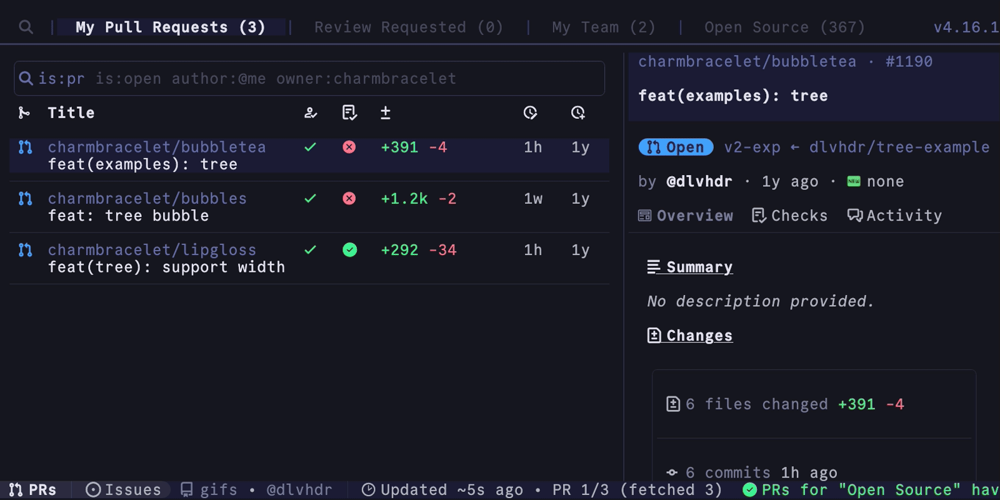

<br />
<p align="center">
  <a  class="underline: none;" href="https://gh-dash.dev">
    <picture>
      <source media="(prefers-color-scheme: dark)" srcset="./docs/public/logo.png">
      
    </picture>
  </a>
</p>

<p align="center">
    <a href="https://gh-dash.dev" target="_blank">→ https://gh-dash.dev ←</a>
</p>
<p align="center">
  A rich terminal UI for GitHub that doesn't break your flow.
  <br />
  <br />
  <a href="https://github.com/dlvhdr/gh-dash/releases"></a>
  <a href="https://discord.gg/SXNXp9NctV"></a>
  <a href="https://github.com/sponsors/dlvhdr"></a>
  <a href="https://www.jetify.com/devbox/docs/contributor-quickstart/" alt="Built with Devbox"></a>
</p>

<br />



## 📃 Docs

Installation instructions, configuration options etc. can be found at the docs
site.

See the [Getting Started](https://gh-dash.dev/getting-started) guide.

## ❤️ Donating

If you enjoy dash and want to help, consider supporting the project with a
donation at [dlvhdr's sponsors page](https://github.com/sponsors/dlvhdr).

## ✨ Features

- 🌅 fully configurable - define sections using GitHub filters
- 🔍 search for prs, issues, and notifications
- 📝 customize columns with `hidden`, `width` and `grow` props
- ⚡️ act on prs, issues, and notifications with checkout, comment, open, merge, diff, mark as read/done, etc...
- ⌨️ set custom actions with new keybindings
- 💅 use custom themes
- 🔭 view details about a pr/issue with a detailed sidebar
- 🪟 write multiple configuration files to easily switch between completely different dashboards
- ♻️ set an interval for auto refreshing the dashboard
- 📁 smart filtering - auto-filter pr/issue lists to the remote tracked by the current directory
- 🔔 manage GitHub notifications - view, filter, mark as read/done, and track notification activity

## 📦 Installation

1. Install the `gh` CLI - see the [installation](https://github.com/cli/cli#installation)

2. Install this extension:

   ```sh
   gh extension install dlvhdr/gh-dash
   ```

3. To get the icons to render properly you should download and install a Nerd font from https://www.nerdfonts.com/.
   Then, select that font as your font for the terminal.

<details>
   <summary>Installing Manually</summary>

> If you want to install this extension **manually**, follow these steps:

1. Clone the repo

   ```shell
   # git
   git clone https://github.com/dlvhdr/gh-dash
   ```

   ```shell
   # GitHub CLI
   gh repo clone dlvhdr/gh-dash
   ```

2. Cd into it

   ```bash
   cd gh-dash
   ```

3. Build it

   ```bash
   go build
   ```

4. Install it locally
   ```bash
   gh extension install .
   ```
   </details>

<details>
    <summary>Updating from an older version</summary>

```bash
gh extension upgrade dlvhdr/gh-dash
```

</details>

## ⚡️ Usage

Run

```sh
gh dash
```

Then press <kbd>?</kbd> for help.

Run `gh dash --help` for more info:

```
Usage:
  gh dash [flags]

Flags:
  -c, --config string   use this configuration file
                        (default lookup:
                          1. a .gh-dash.yml file if inside a git repo
                          2. $GH_DASH_CONFIG env var
                          3. $XDG_CONFIG_HOME/gh-dash/config.yml
                        )
      --debug           passing this flag will allow writing debug output to debug.log
  -h, --help            help for gh-dash
```

## ⚙️ Configuring

See the docs at [https://gh-dash.dev/configuration](https://gh-dash.dev/configuration).

## 🙏 Contributing

See the contribution guide at [https://www.gh-dash.dev/contributing](https://www.gh-dash.dev/contributing/).

## 🛞 Under the hood

gh-dash uses:

- [bubbletea](https://github.com/charmbracelet/bubbletea) for the TUI
- [lipgloss](https://github.com/charmbracelet/lipgloss) for the styling
- [glamour](https://github.com/charmbracelet/glamour) for rendering markdown
- [vhs](https://github.com/charmbracelet/vhs) for generating the GIF
- [cobra](https://github.com/spf13/cobra) for the CLI
- [gh](https://github.com/cli/cli) for the GitHub functionality
- [delta](https://github.com/dandavison/delta) for viewing PR diffs

## Author

Dolev Hadar dolevc2@gmail.com
